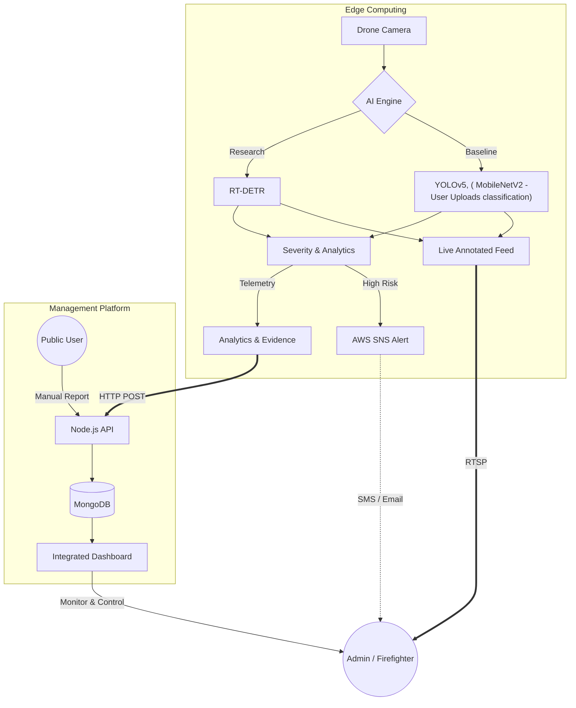
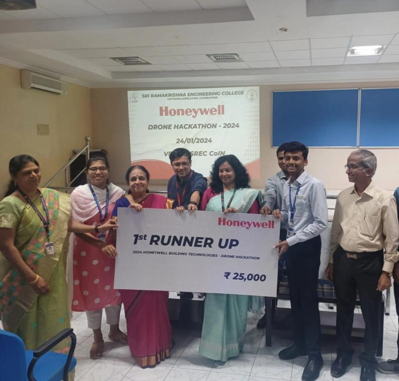
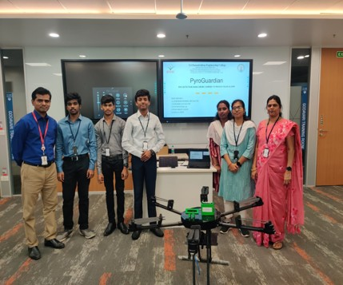

# PyroGuardian: Edge-AI Fire Detection & Monitoring Suite

[](https://opensource.org/licenses/MIT)
[](https://www.python.org/downloads/)
[](https://developer.nvidia.com/deepstream-sdk)


## Overview
PyroGuardian is an end-to-end computer vision ecosystem designed for real-time fire detection, risk assessment, and emergency reporting. It integrates high-performance AI at the edge with a user-friendly cloud-connected dashboard.

### **System Architecture**

---

## 🏆 Awards & Recognition
*   **1st Runner-Up** – [Honeywell Building Technologies Drone Hackathon 2024](https://www.honeywell.com/). 
    *   Recognized for "Mission-Critical Fire Detection" at the Honeywell Bangalore Campus.
    *   Awarded for excellence in UAV-Edge integration and real-time severity classification.

    <p align="center">
    
    
    
    <p align="center">
    <a href="https://drive.google.com/file/d/1fyaNfSNrJdT4sj8eMezI0X0dS66r8lj6/view?usp=drive_link" target="_blank">
        <br/>
        <b>▶ Watch Demo Video</b>
    </a>
    </p>

    </p>


---

## 🚀 Key Performance Indicators
| Metric | Baseline (YOLOv5) | Optimized (RT-DETR) |
| :--- | :--- | :--- |
| **Inference Latency** | 250ms | **33ms** |
| **Throughput** | 4 FPS | **30 FPS** |
| **Precision** | FP32 | **FP16 / INT8** |
| **Edge Hardware** | Desktop CPU/GPU | **NVIDIA Jetson Nano** |

---

## 📁 Repository Structure
*   **[`detection-engine/`](./detection-engine)**: Core AI modules optimized for Jetson.
    *   `core/`: Alerting logic & AWS SNS/Twilio integration.
    *   `deployment/`: DeepStream GStreamer pipelines.
    *   `training/`: NVIDIA TAO specifications for RT-DETR.
    *   `data-engineering/`: Dataset curation & augmentation tools.
    *   `research-baseline/`: Original YOLOv5 reference implementation.
*   **[`web-dashboard/`](./web-dashboard)**: Full-stack Node.js reporting application.

---

## 🛠 Tech Stack

### Edge AI (Detection Engine)
*   **Platform:** NVIDIA Jetson Nano
*   **Pipeline:** GStreamer (DeepStream SDK), Python bindings (`pyds`)
*   **Models:** RT-DETR (TensorRT Optimized), YOLOv5 (Baseline)
*   **Tools:** OpenCV, PyTorch

### Web Dashboard (Control Plane)
*   **Runtime:** Node.js (v18), Express.js
*   **Database:** MongoDB, Mongoose ODM
*   **Frontend:** Vanilla JS, Leaflet.js, Chart.js
*   **Security:** Helmet, Rate-Limiting, Bcrypt

### DevOps & Infrastructure
*   **Containerization:** Docker (Multi-stage, Non-root security)
*   **CI/CD:** GitHub Actions (Automated Testing & Linting)
*   **Cloud:** AWS SNS, Twilio

---

## 👩‍💻 Engineering Standards
This project adheres to production-grade software engineering practices:
*   **CI/CD Pipeline:** Automated testing for both Python and Node.js environments on every push.
*   **Code Quality:** Enforced via `ruff`, `black` (Python) and `eslint`, `prettier` (JavaScript).
*   **Security:** Hardened Docker containers, API rate limiting, and strict environment variable management.

---

## 📚 Documentation & Manual Setup
For component-specific details, development guides, and architecture deep-dives, please consult the respective documentation:

*   **[🤖 Detection Engine Documentation](./detection-engine/README.md)**
    *   *For: AI Engineers, Edge Deployment, Model Training (TAO), GStreamer Pipelines.*
*   **[💻 Web Dashboard Documentation](./web-dashboard/README.md)**
    *   *For: Full-stack Developers, API Specs, Database Schema.*

---

## 🚀 Quick Start (Golden Path)
The fastest way to spin up the entire PyroGuardian ecosystem (Dashboard + Database + Detection Engine) is via Docker Compose.

### Prerequisites
*   [Docker Desktop](https://www.docker.com/products/docker-desktop/) installed and running.

### 1. Configure Environment
Create the necessary environment files from templates:
```bash
# Root environment (optional override)
cp detection-engine/.env.example detection-engine/.env
cp web-dashboard/.env.example web-dashboard/.env
```

### 2. Launch System
```bash
docker-compose up --build
```

### 3. Access Services
*   **Web Dashboard:** [http://localhost:8000](http://localhost:8000)
*   **MongoDB:** `mongodb://localhost:27017`

---

## 📖 Manual Developer Setup
If you prefer to run components individually for development, please refer to the specific installation guides:
1.  **AI Engine:** Follow the [Detection Engine Setup](./detection-engine/README.md#setup--usage).
2.  **Web Dashboard:** Follow the [Dashboard Setup](./web-dashboard/README.md#developer-quick-start).

---

## 📜 Research & Methodology
This project implements a **Targeted Augmentation** strategy to handle high-occlusion fire scenarios (smoke, fog). By distilling knowledge from an 86.7M parameter RT-DETR model into a TensorRT-optimized engine, we achieve near-lossless accuracy at a 90% speed improvement on edge hardware.
