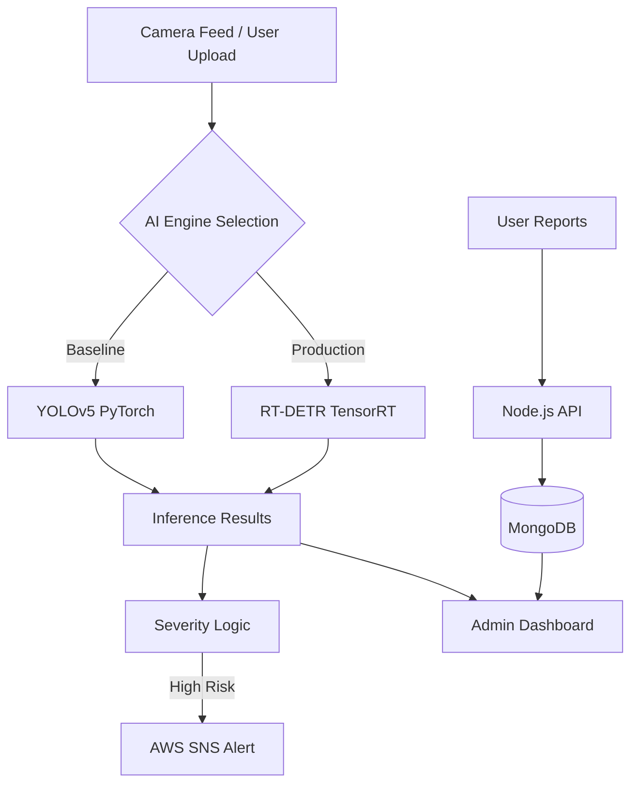

# PyroGuardian: Edge-AI Wildfire Detection & Monitoring Suite

[](https://opensource.org/licenses/MIT)
[](https://www.python.org/downloads/)
[](https://developer.nvidia.com/deepstream-sdk)

## 🌟 Overview
PyroGuardian is an end-to-end computer vision ecosystem designed for real-time wildfire detection, risk assessment, and emergency reporting. It integrates high-performance AI at the edge with a user-friendly cloud-connected dashboard.

### **System Architecture**


---

## 🚀 Key Performance Indicators
| Metric | Baseline (YOLOv5) | Optimized (RT-DETR) |
| :--- | :--- | :--- |
| **Inference Latency** | 250ms | **33ms** |
| **Throughput** | 4 FPS | **30 FPS** |
| **Precision** | FP32 | **FP16 / INT8** |
| **Edge Hardware** | Desktop CPU/GPU | **NVIDIA Jetson Nano** |

---

## 📁 Repository Structure
*   **[`detection-engine/`](./detection-engine)**: Core AI modules optimized for Jetson.
    *   `core/`: Alerting logic & AWS SNS/Twilio integration.
    *   `deployment/`: DeepStream GStreamer pipelines.
    *   `training/`: NVIDIA TAO specifications for RT-DETR.
    *   `data-engineering/`: Dataset curation & augmentation tools.
    *   `research-baseline/`: Original YOLOv5 reference implementation.
*   **[`web-dashboard/`](./web-dashboard)**: Full-stack Node.js reporting application.

---

## 🛠 Tech Stack
*   **Vision:** RT-DETR, YOLOv11, OpenCV, GStreamer.
*   **Optimization:** NVIDIA TensorRT, CUDA, TAO Toolkit.
*   **Cloud:** AWS SNS, Twilio, Boto3.
*   **Web:** Node.js, Express, MongoDB, Leaflet.js (Maps), Chart.js.

---

## 📖 Setup & Configuration

### 1. Environment Variables
Both modules require `.env` files for security. Templates are provided as `.env.example`.

**AI Engine (`detection-engine/.env`):**
```env
TWILIO_ACCOUNT_SID=your_sid
TWILIO_AUTH_TOKEN=your_token
SNS_TOPIC_ARN=your_aws_sns_arn
AWS_ACCESS_KEY_ID=your_key
AWS_SECRET_ACCESS_KEY=your_secret
```

**Web Dashboard (`web-dashboard/.env`):**
```env
MONGO_URI=your_mongodb_uri
PORT=8000
ADMIN_EMAIL=admin@example.com
ADMIN_PASSWORD=securepassword
WEATHER_API_KEY=your_openweathermap_key
```

### 2. Installation
**Detection Engine:**
```bash
cd detection-engine
pip install -r requirements.txt
python deployment/fire_detection_pipeline.py
```

**Web Dashboard:**
```bash
cd web-dashboard
npm install
node server.js
```

---

## 📜 Research & Methodology
This project implements a **Targeted Augmentation** strategy to handle high-occlusion fire scenarios (smoke, fog). By distilling knowledge from an 86.7M parameter RT-DETR model into a TensorRT-optimized engine, we achieve near-lossless accuracy at a 90% speed improvement on edge hardware.
